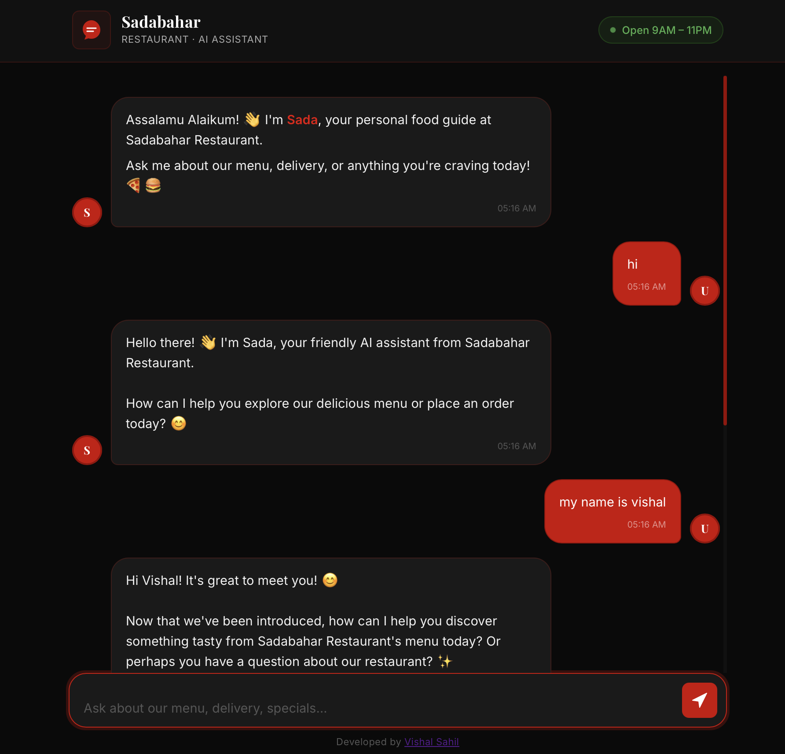

# 🍕 Sadabahar Restaurant Chatbot

> A production-ready AI-powered restaurant chatbot built with FastAPI, LangChain, and Google Gemini — featuring hybrid summarization memory, session management, and a sleek Black & Red themed frontend.

---

## 🖥️ Live Preview



> **Try it live:** [sadabahar-restaurant-bot.vercel.app](https://sadabahar-restaurant-bot.vercel.app)

---

## 📋 Table of Contents

1. [Overview](#overview)
2. [System Architecture](#system-architecture)
3. [Features](#features)
4. [File Structure](#file-structure)
5. [Prerequisites](#prerequisites)
6. [Setup & Installation](#setup--installation)
7. [Environment Variables](#environment-variables)
8. [API Reference](#api-reference)
9. [Memory System](#memory-system)
10. [Menu System](#menu-system)
11. [Frontend](#frontend)
12. [Development Phases](#development-phases)
13. [Error Handling](#error-handling)
14. [Testing](#testing)
15. [Production Deployment](#production-deployment)
16. [Tech Stack](#tech-stack)
17. [Author](#author)

---

## Overview

**Sadabahar Restaurant Chatbot** is a full-stack conversational AI system built for restaurant customer interactions. It provides:

- Real-time menu recommendations with exact prices
- Order guidance and delivery information
- Session-isolated conversations — no cross-user data leakage
- Intelligent hybrid memory with progressive summarization
- Anti-hallucination system — only recommends items from the defined menu
- A sleek Black & Red themed frontend

The system is built to be **production-ready**, **modular**, and **fully extensible**.

---

## System Architecture

```
┌─────────────────────────────────────────────────────────────┐
│                        CLIENT (Browser)                     │
│                   Black & Red Chat UI (HTML/CSS/JS)         │
└────────────────────────┬────────────────────────────────────┘
                         │  HTTP POST /chat
                         ▼
┌─────────────────────────────────────────────────────────────┐
│                    FastAPI Backend                           │
│  ┌──────────────┐  ┌──────────────┐  ┌──────────────────┐  │
│  │   Routes     │  │  Middleware  │  │  Error Handlers  │  │
│  │  /chat       │  │  CORS        │  │  Validation      │  │
│  │  /health     │  │  Logging     │  │  LLM Fallback    │  │
│  └──────┬───────┘  └──────────────┘  └──────────────────┘  │
│         │                                                   │
│         ▼                                                   │
│  ┌──────────────────────────────────────────────────────┐   │
│  │               Chat Service                           │   │
│  │  ┌─────────────────┐   ┌──────────────────────────┐ │   │
│  │  │  Memory Manager │   │    LangChain LLM Chain   │ │   │
│  │  │  - summarize()  │   │    - System Prompt       │ │   │
│  │  │  - update()     │   │    - Context Builder     │ │   │
│  │  │  - get_context()│   │    - Response Generator  │ │   │
│  │  └────────┬────────┘   └──────────────────────────┘ │   │
│  └───────────┼──────────────────────────────────────────┘   │
└──────────────┼──────────────────────────────────────────────┘
               │
               ▼
┌─────────────────────────────────────────────────────────────┐
│                   Memory Storage Layer                      │
│  In-Memory Dict (Demo) / Redis (Production)                 │
│                                                             │
│  {                                                          │
│    "session_id": {                                          │
│      "summaries": [...],   ← max 5 rolling summaries       │
│      "last_messages": [...] ← current + last bot response  │
│    }                                                        │
│  }                                                          │
└─────────────────────────────────────────────────────────────┘
```

---

## Features

### Core Features
- **Session Management** — Each user gets a unique `session_id`; conversations are fully isolated
- **Hybrid Summarization Memory** — Smart 3-phase memory that keeps context without bloating the LLM prompt
- **LangChain + Gemini Integration** — Powered by Google Gemini via LangChain
- **API Key Rotation** — Automatically rotates between multiple Gemini API keys when quota is exceeded
- **Menu-Aware Responses** — Bot only recommends items from the defined menu
- **Delivery Logic** — Enforces 10 km delivery radius and 9 AM–11 PM timing rules
- **Anti-Hallucination** — Strict system prompt prevents AI from making up menu items or prices

### Technical Features
- REST API with FastAPI
- CORS-enabled for frontend integration
- Structured logging with Loguru
- Graceful error handling (empty input, LLM failure, invalid sessions)
- Modular codebase (routes, services, memory, utils)
- Retry logic with exponential backoff via Tenacity

---

## File Structure

```
sadabahar-restaurant-chatbot/
│
├── README.md
├── requirements.txt
├── render.yaml                      ← Render deployment config
├── .env                             ← never commit
├── .env.example
├── .gitignore
│
├── main.py                          ← FastAPI entry point
│
├── routes/
│   ├── __init__.py
│   ├── chat.py                      ← POST /chat
│   └── health.py                    ← GET /health
│
├── services/
│   ├── __init__.py
│   ├── chat_service.py              ← Chat pipeline orchestration
│   └── llm_service.py              ← Gemini LLM + key rotation
│
├── memory/
│   ├── __init__.py
│   ├── memory_manager.py            ← Session store (dict/Redis)
│   ├── summarizer.py                ← Summarization logic
│   └── context_builder.py          ← 3-phase context builder
│
├── utils/
│   ├── __init__.py
│   ├── validators.py                ← Input validation
│   ├── logger.py                    ← Structured logging
│   └── menu.py                      ← Menu JSON definition
│
├── config/
│   ├── __init__.py
│   └── settings.py                  ← Pydantic settings / env loader
│
├── prompts/
│   └── system_prompt.py             ← Restaurant system prompt
│
├── frontend/
│   ├── index.html                   ← Chat UI (Black & Red theme)
│   ├── style.css                    ← Custom styles
│   └── app.js                       ← Fetch API integration
│
└── tests/
    ├── __init__.py
    ├── test_chat.py
    └── test_memory.py
```

---

## Prerequisites

| Tool | Version |
|---|---|
| Python | **3.10 or higher, below 3.12** |
| pip | Latest |
| Git | Latest |
| Google Gemini API Key | Required (free at aistudio.google.com) |
| Redis | Optional (for production memory) |

> ⚠️ **Important:** Python version must be **≥ 3.10 and < 3.12**. Python 3.12+ may cause dependency conflicts with some LangChain packages.

---

## Setup & Installation

### Step 1 — Clone the Repository

```bash
git clone https://github.com/vishalsahilai/sadabahar-restaurant-chatbot.git
cd sadabahar-restaurant-chatbot
```

### Step 2 — Create Virtual Environment

```bash
# Create venv
python -m venv venv

# Activate on macOS/Linux
source venv/bin/activate

# Activate on Windows
venv\Scripts\activate
```

### Step 3 — Install Dependencies

```bash
pip install -r requirements.txt
```

### Step 4 — Set Up Environment Variables

```bash
cp .env.example .env
# Open .env and add your Gemini API key(s)
```

### Step 5 — Run the Backend

```bash
python -m uvicorn main:app --reload
```

### Step 6 — Open the Frontend

```bash
cd frontend
python -m http.server 3000
```

Then visit: `http://localhost:3000`

---

## Environment Variables

```env

# Gemini API Keys (supports up to 3 keys)
# Get free keys at: aistudio.google.com
# Automatically rotates when quota is hit

GOOGLE_API_KEY_1=your-gemini-key-1
GOOGLE_API_KEY_2=your-gemini-key-2
GOOGLE_API_KEY_3=your-gemini-key-3

GEMINI_MODEL=gemini-2.5-flash-preview-05-20
LLM_TEMPERATURE=0.7
LLM_MAX_TOKENS=512


# App Configuration

APP_ENV=development
APP_HOST=0.0.0.0
APP_PORT=8000
DEBUG=true


# Memory Configuration

MEMORY_BACKEND=dict
MAX_SUMMARIES=5


# Redis (optional — production only)

REDIS_HOST=localhost
REDIS_PORT=6379
REDIS_DB=0
REDIS_PASSWORD=


# CORS

CORS_ORIGINS=["http://localhost:3000","http://127.0.0.1:3000"]
```

---

## API Reference

### `POST /chat`

Send a message to the restaurant chatbot.

**Request:**
```json
{
  "session_id": "user_abc123",
  "message": "What pizzas do you have?"
}
```

**Success Response `200 OK`:**
```json
{
  "session_id": "user_abc123",
  "response": "We have amazing pizzas! 🍕 Margherita (Small PKR 750, Medium PKR 1,250, Large PKR 1,750) and Pepperoni (Small PKR 900, Medium PKR 1,450, Large PKR 2,050). Which size would you like?",
  "message_count": 1
}
```

**Error `400 Bad Request`:**
```json
{
  "detail": "Message cannot be empty."
}
```

**Error `503 Service Unavailable`:**
```json
{
  "detail": "LLM service is temporarily unavailable. Please try again."
}
```

---

### `GET /health`

```json
{
  "status": "healthy",
  "service": "Sadabahar Restaurant Chatbot",
  "version": "1.0.0",
  "environment": "production",
  "memory_backend": "dict",
  "timestamp": "2026-08-01T05:16:00Z"
}
```

---

## Memory System

The core intelligence of the chatbot. Uses a **3-phase hybrid summarization** approach to keep LLM context lean and relevant.

```
Message 1  →  Send directly to LLM (no prior context)

Message 2  →  Send full previous exchange + current message

Message 3+ →  DO NOT send full history
              Instead:
                1. Summarize previous interactions
                2. Store summary (keep last 5 max)
                3. Send: [Summaries] + [Current Message]
```

### Summary Structure

```json
{
  "user_intent": "User asked about pizza options",
  "bot_response": "Recommended Margherita and Pepperoni with prices",
  "context": "User is interested in pizza, may want to order"
}
```

### Memory Store Structure

```python
{
  "session_id_xyz": {
    "summaries": [...],      # max 5 rolling summaries
    "last_messages": [...],  # last user + bot message
    "message_count": 5       # total messages in session
  }
}
```

---

## Menu System

Defined in `utils/menu.py` as a JSON object. The LLM is strictly instructed to only use this data — no hallucination allowed.

```json
{
  "pizza": ["Margherita", "Pepperoni", "Chicken Tikka", "BBQ Chicken", "Supreme"],
  "burger": ["Zinger Burger", "Beef Burger", "Crispy Chicken", "Grilled Chicken"],
  "drinks": ["Coca-Cola", "Mango Lassi", "Mineral Water", "Mint Margarita"],
  "sides": ["Garlic Bread", "French Fries", "Coleslaw", "Chicken Nuggets"],
  "desserts": ["Chocolate Brownie", "Gulab Jamun", "Ice Cream Sundae"],
  "bbq": ["Chicken Tikka", "Chicken Boti", "Malai Boti"],
  "pakistani": ["Chicken Biryani", "Chicken Karahi", "Nihari", "Haleem"],
  "deals": ["Family Deal 1", "Family Deal 2", "Combo 1", "Combo 2"]
}
```

---

## Frontend

Single-page chat UI served from the `frontend/` folder.

### Design

| Element | Value |
|---|---|
| Background | `#0A0A0A` (Black) |
| Primary Color | `#CC0000` (Red) |
| Bot bubble | Dark gray with red border |
| User bubble | Red |
| Font | Inter + Playfair Display |
| Input | Dark with red focus glow |
| Send button | Red with hover glow effect |

### Features
- Auto-generates `session_id` stored in `localStorage`
- Quick suggestion buttons (View Pizzas, View Burgers, Delivery Info, Opening Hours)
- Typing indicator with animated red dots
- Timestamps on every message
- Mobile responsive
- Send on Enter, Shift+Enter for newline

---

## Development Phases

- **Phase 1** — Project setup + virtual environment
- **Phase 2** — FastAPI backend + CORS middleware
- **Phase 3** — Gemini LLM integration + system prompt
- **Phase 4** — Hybrid summarization memory system
- **Phase 5** — API endpoints + input validation
- **Phase 6** — Black & Red frontend UI
- **Phase 7** — Testing + deployment

---

## Error Handling

| Scenario | HTTP Status | Response |
|---|---|---|
| Empty message | `400` | `"Message cannot be empty."` |
| Message too long (>2000 chars) | `400` | `"Message too long."` |
| LLM timeout or failure | `503` | `"LLM service unavailable."` |
| All API keys quota exceeded | `503` | `"LLM service unavailable."` |
| Session not found | `200` | New session auto-created |
| Invalid JSON body | `422` | FastAPI validation error |

---

## Testing

```bash
# Run all tests
pytest tests/ -v

# Run specific tests
pytest tests/test_memory.py -v
pytest tests/test_chat.py -v
```

### Manual Test with cURL

```bash
# Health check
curl https://your-backend.onrender.com/health

# Send a message
curl -X POST https://your-backend.onrender.com/chat \
  -H "Content-Type: application/json" \
  -d '{"session_id": "test123", "message": "What burgers do you have?"}'
```

---

## Production Deployment

### Backend → Render (Free)

```yaml
# render.yaml
services:
  - type: web
    name: sadabahar-chatbot
    env: python
    plan: free
    buildCommand: pip install -r requirements.txt
    startCommand: python -m uvicorn main:app --host 0.0.0.0 --port $PORT
```

### Frontend → Netlify (Free)

1. Go to netlify.com
2. Drag and drop your `frontend/` folder
3. Done — live in 30 seconds

### Switch to Redis Memory

```env
MEMORY_BACKEND=redis
REDIS_HOST=your-redis-host
REDIS_PORT=6379
REDIS_PASSWORD=your-password
```

---

## Tech Stack

| Layer | Technology |
|---|---|
| Backend | FastAPI (Python 3.10–3.11) |
| LLM Framework | LangChain |
| LLM Provider | Google Gemini (free tier) |
| Memory (demo) | In-memory Python dict |
| Memory (prod) | Redis |
| Frontend | Vanilla HTML / CSS / JavaScript |
| Testing | pytest |
| Logging | Loguru |
| Server | Uvicorn / Gunicorn |
| Deployment | Render + Netlify (both free) |

---

## Author

**Vishal Sahil** — AI Automation Engineer

- 🌐 Portfolio: [vishalsahilai.vercel.app](https://vishalsahilai.vercel.app)
- 💼 LinkedIn: [linkedin.com/in/vishal-sahil-ai](https://linkedin.com/in/vishal-sahil-ai)
- 🐙 GitHub: [github.com/vishalsahilai](https://github.com/vishalsahilai)
- 📧 Email: vishalsahilofficial@gmail.com

---

## License

MIT License — Free to use, modify, and distribute.

---

> Built with ❤️ by Vishal Sahil · Powered by LangChain + Google Gemini